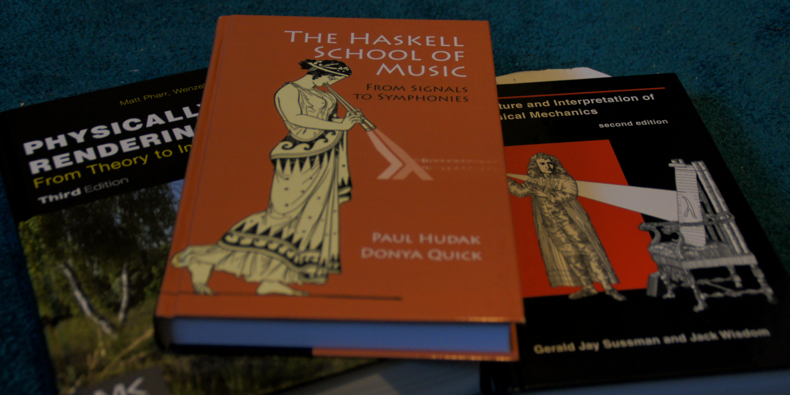
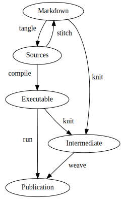
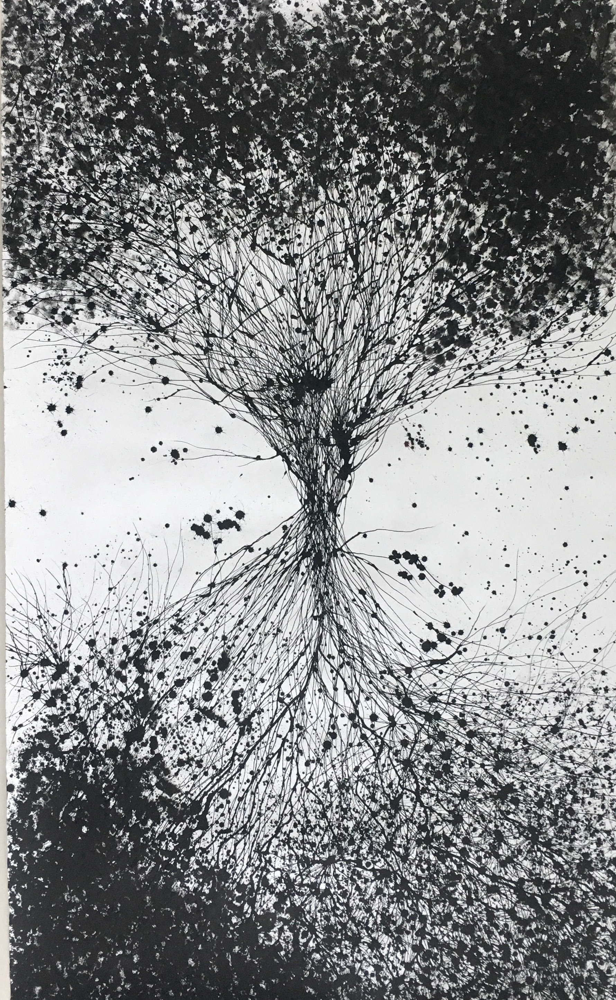
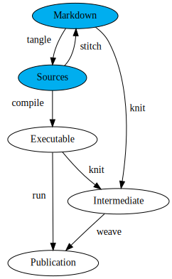

# Literate Programming

## Donald Knuth


::: {.notes}
- Donald Knuth: “The Art of Computer Programming”, “Surreal Numbers”
- Inventor of literate programming
- “nobody wants to admit writing an illiterate program”
:::

## Why *Literate programming*?

{style="border: none; width: 40%"}

> ... nobody wants to admit writing an illiterate program ...

## Motivation

scientific rigour
: Should extend to **software** $\to$ "Open Science"

epistemology
: Explain it to a six-year old

programming literacy
: Read other people's code

::: {.notes}
- Epistemology: theory of knowledge
- When can we say we know something?
- example: relativity.
- Scientists are not trained programmers.
- Need code exposure
:::

## Books



## Existing tools

- Noweb
- Emacs Org-mode
- KnitR
- Jupyter

## Tools and workflow

::: {.container}
:::: {.col}
- Pandoc [@Pandoc]
- Lua filters
- Entangled
::::

:::: {.col}

::::
:::

# Hello, World!

## Introduction
- *Literate programming* [@Knuth1984].
- System of references: *noweb* [@Ramsey1994].

## References
- References inside code blocks: `<<...>>`

``` {.cpp file=hello_world.cc}
#include <cstdlib>
#include <iostream>

<<example-main-function>>
```

## References
- Code-blocks have names

``` {.cpp #example-main-function}
int main(int argc, char **argv) {
  <<hello-world>>
}
```

``` {.cpp #hello-world}
std::cout << "Hello, World!" << std::endl;
```

## References
* And can be appended to

``` {.cpp #hello-world}
return EXIT_SUCCESS;
```

## Tangling
* Code blocks are *tangled* into source files.

``` {.cpp file=hello_world.cc}
#include <cstdlib>
#include <iostream>

int main(int argc, char **argv) {
    std::cout << "Hello, World!" << std::endl;
    return EXIT_SUCCESS;
}
```

# Entangled

## Entangled

::: {.container}
:::: {.col}
- Tangle and stitch
- Editor independent
- Language independent
- [jhidding.github.io/enTangleD](https://jhidding.github.io/enTangleD)
::::
:::: {.col}
{style="width:60%"}
::::
:::

## Entangled

::: {.container}
:::: {.col}
- Tangle: generates source code from Markdown
- Stitch: changes are pushed back to the Markdown
- [jhidding.github.io/enTangleD](https://jhidding.github.io/enTangleD)

{style="border:none;padding:15pt;width:80%"}
::::

:::: {.col}

::::
:::

## Bibliography

