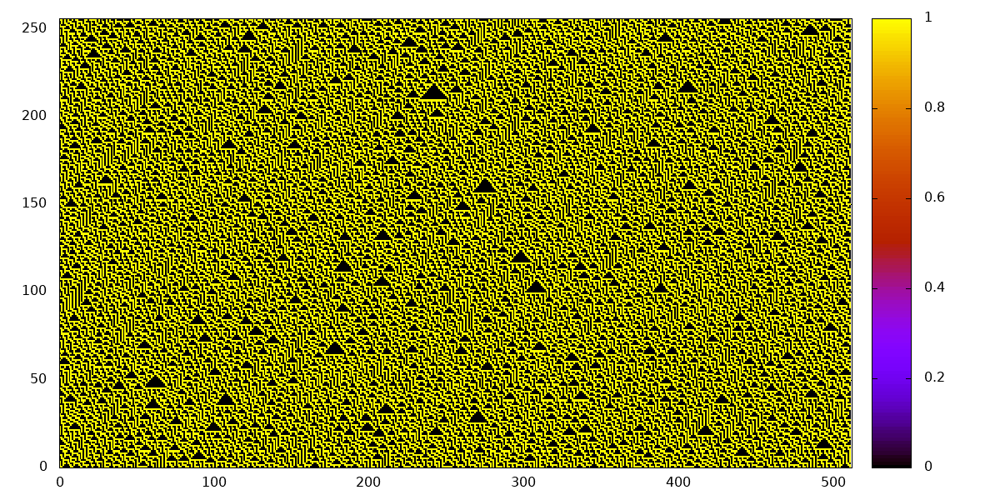

# The universe

The universe is a circular space with $N$ bits. It started out completely random

``` {.julia #and-the-earth-was-without-form-and-void}
universe = rand(Bool, N)
```

Then there was connection: each bit has a neighbourhood: itself and its two direct neighbours. There are $2^3 = 8$ different possible neighbourhoods.

``` {.julia #eca}
function neighbourhood(u)
    return circshift(u, 1) * 4 .+ u * 2 .+ circshift(u, -1) .+ 1
end
```

Then there was time: each bit would evolve by a rule based on its neighbourhood. There are $2^8 = 256$ possible rules.

``` {.julia #eca}
function rule(p)
    rule_map = convert(Array{Bool}, digits(p, base=2, pad=8))
    return (u) -> rule_map[neighbourhood(u)]
end
```

And using the rule we can evolve.

``` {.julia #eca}
function evolve(rule, u)
    return Channel() do ch
        put!(ch, u)
        while true
            u = rule(u)
            put!(ch, u)
        end
    end
end
```

And life was born in Figure @fig:rule30.

{#fig:rule30}

## Printing output

``` {.julia #eca}
function print_matrix(x)
    println(join([join((string ∘ Int64).(y), " ")
                  for y in eachcol(x)], "\n"))
end
```

## App

To parse command line arguments in Julia we start with the following skeleton:

``` {.julia file=src/ca.jl}
using ArgParse

<<eca>>

function parse_command_line()
    s = ArgParseSettings()

    @add_arg_table! s begin
        <<command-line-arguments>>
    end

    return parse_args(s)
end

function main()
    args = parse_command_line()
    <<main>>
end

main()
```

### Arguments

#### Size of the universe

``` {.julia #command-line-arguments}
"--size", "-s"
    help = "size of universe"
    default = "512"
```

#### Age of the universe

``` {.julia #command-line-arguments}
"--gen", "-g"
    help = "number of generations"
    default = "512"
```

#### Rule

``` {.julia #command-line-arguments}
"--rule", "-r"
    help = "rule number"
    default = "30"
```

### Main function

``` {.julia #main}
N = parse(Int64, args["size"])
T = parse(Int64, args["gen"])
p = parse(Int64, args["rule"])

<<and-the-earth-was-without-form-and-void>>
history = Iterators.take(evolve(rule(p), universe), T)
print_matrix(hcat(collect(history)...))
```
